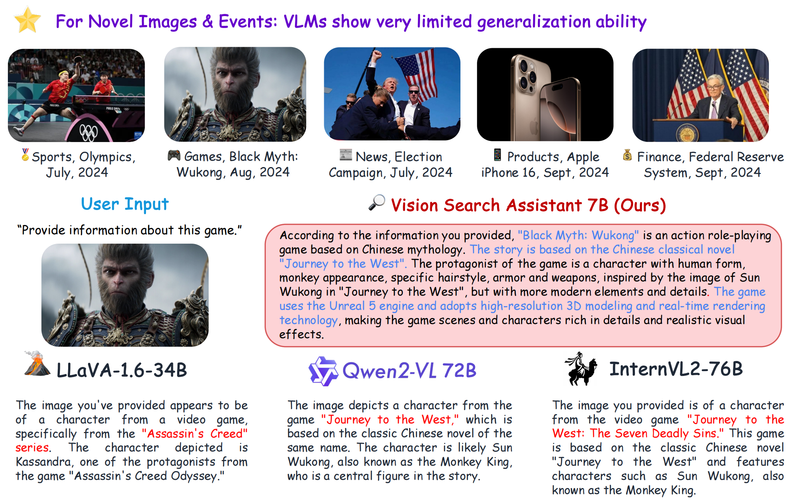
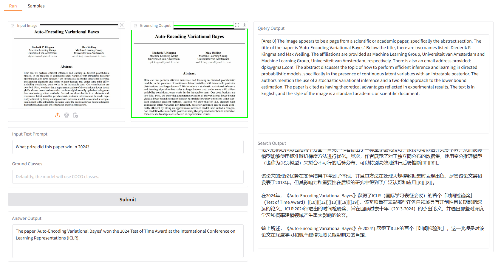

## Vision Search Assistant: Empower Vision-Language Models as Multimodal Search Engines

[🌐[Project Page](https://cnzzx.github.io/VSA/)]
[📄[Paper](https://arxiv.org/abs/2410.21220)]
[🤗[Hugging Face Space](https://huggingface.co/spaces/Yiyuan/VSA)]
[💻[Model Zoo](./docs/model_zoo.md)]



## 💫 Release

- [2024/10/29] We released the code for the local demo.
- [2024/10/29] Vision Search Assistant is released on [arxiv](https://arxiv.org/abs/2410.21220). 

## ⚙️ Setup

1. Clone this repository and navigate to VSA folder.
```
git clone https://github.com/cnzzx/VSA.git
cd VSA
```

2. Create conda environments.
```
conda create -n vsa python=3.10
conda activate vsa
```

3. Install LLaVA.
```
cd models/LLaVA
pip install -e .
```

4. Install other requirements.
```
pip install -r requirements.txt
```


## ⭐ Local Demo
The local demo is based on gradio, and you can simply run with:

```
python app.py
```

### Run Inference


- In the "Run" UI, you can upload one image in the "Input Image" panel, and type in your question in the "Input Text Prompt" panel. Then, click submit and wait for model inference. 
- You can also customize object classes for detection in the "Ground Classes" panel. Please separate each class by commas (followed by a space), such as "handbag, backpack, suitcase."
- On the right are temporary outputs. "Query Output" shows generated queries for searching, and "Search Output" shows web knowledge related to each object.

### Try with Samples


We provide some samples for you to start with. In the "Samples" UI, you can select one in the "Samples" panel, click "Select This Sample", and you will find sample input has already been filled in the "Run" UI.

## 📟 CLI Inference
You can also chat with our Vision Search Assistant in the terminal by running.

```
python cli.py \
    --vlm-model "liuhaotian/llava-v1.6-vicuna-7b" \
    --ground-model "IDEA-Research/grounding-dino-base" \
    --search-model "internlm/internlm2_5-7b-chat" \
    --vlm-load-4bit
```

Then, select an image and type your question.

## 📝 License

This project is released under the [Apache 2.0 license](LICENSE).

## Acknowledgements
Vision Search Assistant is greatly inspired by the following outstanding contributions to the open-source community: [GroundingDINO](https://github.com/IDEA-Research/GroundingDINO), [LLaVA](https://github.com/haotian-liu/LLaVA), [MindSearch](https://github.com/InternLM/MindSearch).

## Citation

If you find this project useful in your research, please consider cite:

```
@article{zhang2024visionsearchassistantempower,
  title={Vision Search Assistant: Empower Vision-Language Models as Multimodal Search Engines},
  author={Zhang, Zhixin and Zhang, Yiyuan and Ding, Xiaohan and Yue, Xiangyu},
  journal={arXiv preprint arXiv:2410.21220},
  year={2024}
}
```
